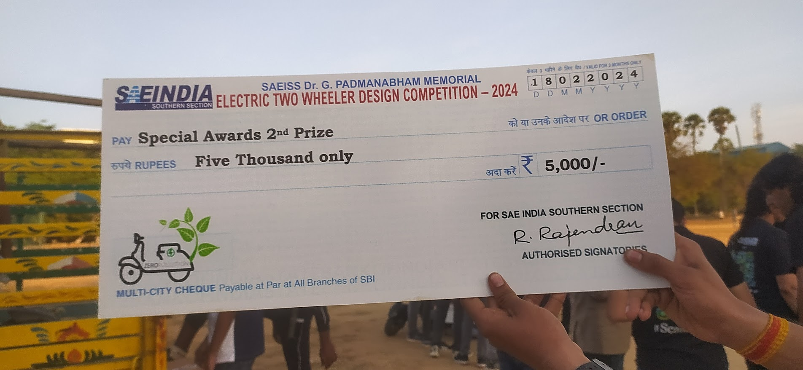

# spark ignited
<!DOCTYPE html>
<html lang="en">
<head>
    <meta charset="UTF-8">
    <meta name="viewport" content="width=device-width, initial-scale=1.0">
    <title>SPARK IGNITED</title>
    <link rel="stylesheet" href="sparkignited.css">
</head>
<body>
    <header>
        

            
        <h1>Spark Ignited</h1>
        

        <nav>
            <ul>
                <li><a href="#welcome">home</a></li>
                <li><a href="#about-us">About</a></li>
                <li><a href="#groups">Groups</a></li>
                <li><a href="#photos">gallery</a></li>
                <li><a href="#contact">Contact</a></li>
                <li><a href="#more">More</a></li>
            </ul>
        </nav>
        

            &#128276;
            

                <input type="text" class="search-box" placeholder="Search..." id="search-input">
                &#128269;
            

        

    </header> 
   <section id="welcome">
        

            <h2>WELCOME</h2>
            
Welcome visitors to your site with a short, engaging introduction. Double click to edit and add your own text.

            <button onclick="startNow()">Start Now</button>
            <button onclick="scrollToSection('about-us')">Next</button>
            

         
    </section>
    <section id="about-us">
        

            <h2>About Us</h2>
            
This is a space to tell users about yourself and your business. Let them know who you are, what you do, and what this website is all about. Double click to start editing.

            <button onclick="learnMore()">Learn More</button>
            <button onclick="scrollToSection('EV-brochure')">Next</button>
            <button onclick="scrollToSection('welcome')">Previous</button>
        

      
    </section>
    <section id="EV-brochure">
        

            <h2>EV brochure</h2>
            
This is a space to tell users about market prize of electric vehical. Let them know about your vehical, what you do, and what this website is all about. Double click to start editing.

            <button onclick="openbrochure()">open brochure</button>
            <button onclick="scrollToSection('photos')">Next</button>
        

    </section>
    <section  id="photos" >
        

            <h1>gallery</h1>
            
            
            
            
            
            
          
           
            
            
            
            
            
            
            
            
            
            
            
            
        <button onclick="toggleMorePhotos()" id="see-more-btn">See More</button>
        

     
    </section>
       <section id="more">
        <h1></h1>
       </section>
       
    
</body>
</html>
